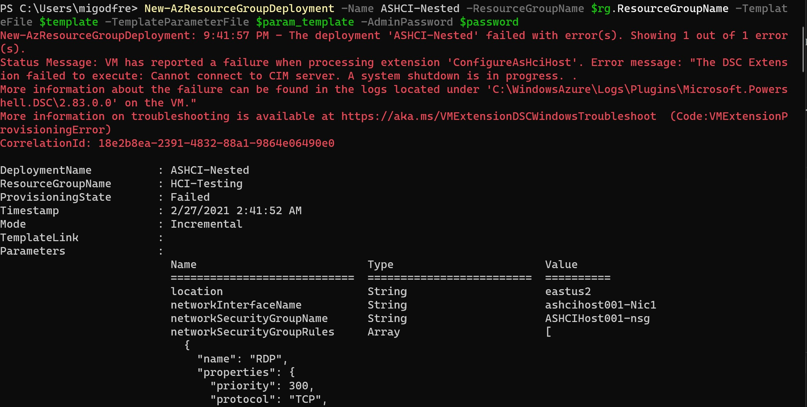

**Welcome to the easiest deployment of Azure Stack HCI, full stack of your life!** With this ARM Template you will be able to deploy a working, nested Azure Stack HCI cluster with Hyper-V, Storage Spaces Direct and Software Defined Networking, all manged by Windows Admin Center. It's so simple!

Want a deeper understanding of Deploying Azure Stack HCI, and ready to learn quickly about the components? 

<a href="https://sway.office.com/f4UzIZqrmGgMqTfZ?ref=Link.office.com/f4UzIZqrmGgMqTfZ?ref=Link" target="_blank">Deploying Azure Stack HCI</a>

***New, the latest build now deploys Version 21H2 of Azure Stack HCI, so you can try out the latest features today! ***

There are two main methods of deployment, GUI using the "Deploy to Azure" button here, or PowerShell. 

Both methods will require you have a few things:

-An Azure Subscription with Permissions to create a Resource Group and at least Contributor Permissions on that Resource Group

-the AZ Powershell Module, simply run Install-Module -Name AZ in your Powershell session. (PowerShell only method)

-Copy of the code, located in this repository.

**Deploy to Azure Method**

You will NEED to supply your own Parameters file, which is located in this repository. You can simply load the file from the JSON folder, or copy/paste. Your choice.

### Prefer a video, no problem! Watch this Getting Started video to well...Get Started with the Azure Stack HCI Sandbox, and within about 2 hours you will be ready to test out Azure Stack HCI! ###
 

First step, you will want to click "Edit Parameters"

Then you will want to load the Parameters File, remember the file is located in the JSON folder in the Repository.

You will need to supply the Resource Group and the Admin Password still, but this is a fairly easy process.

Hit Review+Create.

**PowerShell Process**

If you are more familiar with PowerShell and would rather do the deployment in Command Line, well Awesome, that is how you should be doing this. The instructions are below:

First, you will need to login to your Azure Account in your Terminal Session.

Then you will need to select your Subscription

Following that, you will want to create a Resource Group Name Variable, something like:

then you need a password, stored as a variable, don't forget it, you will need it to login to the VM we create.

Now store the template files as variables. Try something like

and

Phew, we are ready to deploy. Ready, here we go.

So, the deployment may error out, with a warning about the DSC extension not completing due to a system shutdown. Don't worry though. That's the beauty of DSC, the configuration will run every 15 minutes. 

**After Azure Deployment**

When your ARM template completes - which by the way takes some minutes, go to the Virtual Machines portal in Azure and you will see your new VM, ASHCIHost001 if you kept the default name. You need to RDP to the Public IP address of this VM. When loged in, right click to the desktop shortcut **New-AzSCHISandbox** and select **Run with powershell** . This is the script that will deploy and configure your Stack HCI cluster.  It takes more and less 2 hours, and you should come back to 3 Virtual Machines, deployed on this host. That's it, really. You now have a working Azure Stack HCI cluster, it has Hyper-V configured, a Fail over Cluster, Storage Spaces Direct, Software Defined Networking and to manage it all, Windows Admin Center.

Once the scripts are done, using RDP, log into the 'Admincenter' virtual machine (desktop shortcut on desktop!) with your creds: User: Contoso\Administrator Password: Password01. After logged in the AdminCenter VM, launch Google Chrome and go to https://admincenter.contoso.com/ and log in (same credentials used before for 'Admincenter' virtual machine login).

Now you can proceed to /hands-on-labs and start [Lab 1](https://github.com/heloisasorato/AzSHCI-workshop/blob/main/hands-on-labs/1_AzSHCIIntegration.md).

**# Azure Stack HCI Sandbox (2/7/2021)**

The Azure Stack HCI Sandbox is a series of scripts that creates a [HyperConverged](https://docs.microsoft.com/en-us/windows-server/hyperconverged/) environment using four nested Hyper-V Virtual Machines. The purpose of the SDN Sandbox is to provide operational training on Microsoft SDN as well as provide a development environment for DevOPs to assist in the creation and
validation of SDN features without the time consuming process of setting up physical servers and network routers\switches.

>**SDN Sandbox is not a production solution!** SDN Sandbox's scripts have been modified to work in a limited resource environment. Because of this, it is not fault tolerant, is not designed to be highly available, and lacks the nimble speed of a **real** Microsoft SDN deployment.

## Workshop

The ``hands-on-labs`` folder will present you different lab exercises you can take in order to better evaluate features and capabilities of Stack HCI. 

## Configuration Overview

AzSHCISandbox will automatically create and configure the following:

* Active Directory virtual machine
* Windows Admin Center virtual machine
* Routing and Remote Access virtual machine (to emulate a *Top of Rack (ToR)* switch)
* Two node Hyper-V S2D cluster with each having a SET Switch
* One Single Node Network Controller virtual machine
* One Software Load Balancer virtual machine
* Two Gateway virtual machines (one active, one passive)
* Management and Provider VLAN and networks 
* Private, Public, and GRE VIPs and automatically configured in Network Controller
* VLAN to provide testing for L3 Gateway Connections

## Hardware Prerequisites

The AzSHCISandbox can only run on a single host.

|  Number of Hyper-V Hosts | Memory per Host   | HD Available Free Space   | Processor   |  Hyper-V Switch Type |
|---|---|---|---|---|
| 1  | 64gb | 250gb SSD\NVME   | Intel - 4 core Hyper-V Capable with SLAT   | Installed Automatically by Script  |

Please note the following regarding the hardware setup requirements:

* It is recommended that you disable all disconnected network adapters or network adapters that will not be used.

* It is **STRONGLY** recommended that you use SSD or NVME drives (especially in single-host). This project has been tested on a single host with four 5400rpm drives in a Storage Spaces pool with acceptable results, but there are no guarantees.

> **Note:** The VLANs being used can be changed using the configuration file.

>**Note:** If the default Large MTU (Jumbo Frames) value of 9014 is not supported in the switch or NICs in the environment, you may need to set the SDNLABMTU value to 1514 in the SDN-Configuration file.

### NAT Prerequisites

Internet access is required.
On the Hyper-V Host, create a VMswitch  that maps to a NIC attached to a network that has internet access and provides addresses using DHCP. The configuration file will need to be updated to include the name of this VMswitch to use for NAT.

## Software Prerequisites

### Required VHDX files:

 **GUI.vhdx** - Sysprepped Desktop Experience version of Windows Server 2019 **Datacenter**. Only Windows Server 2019 Datacenter is supported. Other releases such as Server Datacenter 1809 are not supported as they do not support S2D.           
  
**AzSHCI.vhdx** - Same requirements.

>**Note:** Product Keys WILL be required to be entered into the Configuration File. If you are using VL media, use the [KMS Client Keys](https://docs.microsoft.com/en-us/windows-server/get-started/kmsclientkeys) keys for the version of Windows you are installing.

## Required Software

[**Windows Admin Center**](https://docs.microsoft.com/en-us/windows-server/manage/windows-admin-center/understand/windows-admin-center) - The latest version of Windows Admin Center's MSI installer file should be at the root of the *Windows Admin Center* folder under *.\Applications*

## Configuration File (NestedSDN-Config) Reference

The following are a list of settings that are configurable and have been fully tested. You may be able to change some of the other settings and have them work, but they have not been fully tested.

>**Note:** Changing the IP Addresses for Management Network (*default of 192.168.1.0/24*) has been succesfully tested.

| Setting                  |Type| Description                                                                                                                         |  Example                           |
|--------------------------------------|--------|-----------------------------------------------------------------------------------------------------------------------------------------------------------------------------------------------------------------|-----------------------------|
| ConfigureBGPpeering                  | bool   | Peers the GW and MUX VMs with the BGP-ToR-Router automatically if ProvisionNC = $true  
| consoleVHDXPath                      | string | This value controls the location of the Windows 10 Console VHDX                                                                                                                                                 | C:\2019 VHDS\Console.vhdx   |
| COREProductKey                       | string | Product key for Datacenter Core. Usually the same key as GUI.                                                                                                                                                   |                             |
| coreVHDXPath                         | string | This value controls the location of the Core VHDX.                                                                                                                                                              | C:\2019 VHDS\2019_CORE.vhdx |
| DCName                               | string | Name of the domain controller. Must be limited to 14 characters.                                                                                                                                                | fabrikam.dc                 |
| GUIProductKey                        | string | Product key for GUI. Usually the same key as Core.                                                                                                                                                              |                             |
| guiVHDXPath                          | string | This value controls the location of the GUI VHDX.                                                                                                                                                               | C:\2019 VHDS\2019_GUI.vhdx  |
| HostVMPath                           | string | This value controls the path where the Nested VMs will be stored on all hosts                                                                                                                                   | V:\VMs                      |
| InternalSwitch                       | string | Name of internal switch that the SDN Lab VMs will use in Single Host mode. This only applies when using a single host. If the internal switch does not exist, it will be created.                               | Fabrikam                    |
| MultipleHyperVHostExternalSwitchName | string | Name of the External Hyper-V VM Switch identical on all hosts making Multiple Hyper-V Hosts                                                                                                                     | "MyExternalSwitch"          |
| MultipleHyperVHostNames              | array  | Array of all of the hosts which make up the Nested VM environment. Only 2 or 4 hosts supported                                                                                                                  | @("XEON8","XEON9")          |
| MultipleHyperVHosts                  | bool   | Set to $true if deploying the Nested VM environment across multiple hosts. Set to $false if deploying to a single host.                                                                                         |                             |
| natConfigure                         | bool   | Specifies whether or not to configure NAT                                                                                                                                                                       |                             |
| natDNS                               | string | DNS address for forwarding from Domain Controller. Currently set to Cloudflare's 1.1.1.1 by default.                                                                                                            | 1.1.1.1                     |
| natExternalVMSwitchName              | string | Name of external virtual switch on the physical host that has access to the Internet.                                                                                                                           | Internet                    |
| natSubnet                            | string | This value is the subnet is the NAT router will use to route to  SDNMGMT to access the Internet. It can be any /24 subnet and is only used for routing. Keep the default unless it overlaps with a real subnet. | 192.168.46.0/24             |
| natVLANID                            | int    | VLAN ID (if needed) that for access to the external network that requires Internet access. (Note: The network will require DHCP).                                                                               |                             |
| NestedVMMemoryinGB                   | int    | This value controls the amount of RAM for each Nested Hyper-V Host (SDNHOST1-3).                                                                                                                                | 13GB                        |
| ProvisionNC                          | bool   | Provisions Network Controller Automatically.                                                                                                                                                                    |                             |
| SDNAdminPassword                     | string | Password for all local and domain accounts.                                                                                                                                                                     | Password01                  |
| SDNDomainFQDN                        | string | Limit name (before the.xxx) to 14 characters as the name will be used as the NetBIOS name.                                                                                                                      | fabrikam.com                |
| SDNLABMTU                            | int    | Controls the MTU for all Hosts. If using multiple physical hosts. Ensure that you have configured MTU on physical nics on the hosts to match this value.                                                        |                             |
| SDNMGMTMemoryinGB                    | int    | This value controls the amount of RAM for the SDNMGMT Nested VM which contains only the Console, Router, Admincenter, and DC VMs.                                                                               | 13GB                        |
| Setting                              | Type   | Description                                                                                                                                                                                                     | Example                     |

## Trademarks

This project may contain trademarks or logos for projects, products, or services. Authorized use of Microsoft 
trademarks or logos is subject to and must follow 
[Microsoft's Trademark & Brand Guidelines](https://www.microsoft.com/en-us/legal/intellectualproperty/trademarks/usage/general).
Use of Microsoft trademarks or logos in modified versions of this project must not cause confusion or imply Microsoft sponsorship.
Any use of third-party trademarks or logos are subject to those third-party's policies.
