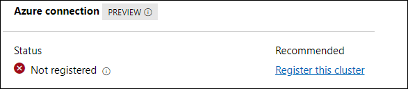
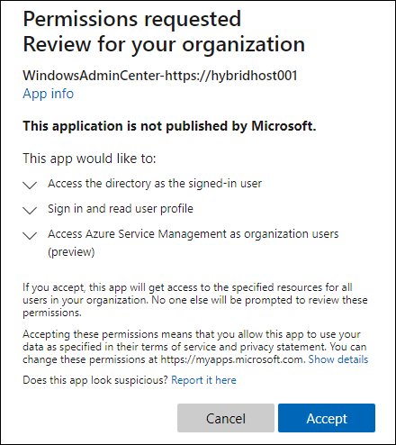

Lab 1: Integrate Azure Stack HCI 21H2 with Azure
==============
Overview
-----------

As part of the lab environment, we have already deployed the Azure Stack HCI 21H2 Cluster, so you don't have to deploy it and you can continue registering the already deployed cluster to unlock full functionality.

In this lab you can do all the normal operations you would expect to do with an Azure Stack HCI Cluster located in your Datacenter or Remote/Branch Office. This Lab is meant to be a nested solution that allows you to test, deploy and understand Azure Stack HCI and all of it's components, including Hyper-V, Failover Clustering, Storage Spaces Direct (S2D) and Software Defined Networking (SDN). In this lab we will focus on management of a 2-node cluster, that has been built and deployed for you, as part of this lab. You can work on the suggested scenarios presented in this lab documentation, or try out any scenarios you can come up with, the freedom is yours!

After the deployment is complete, we will have three Virtual Machines on your Azure host, two Azure Stack HCI Hosts named AZSHost1 & 2 and a Management VM, named AZSMGMT. The AZSMGMT VM is another nested Hyper-V Host, that contains 3 more Virtual Machines:

AdminCenter: A Windows 10 Workstation with Admin Center installed
BGP-TOR-Router: A Windows Server running Routing and Remote Access Server
ContosoDC: Windows Server that is our Domain Controller.

**Important**

Azure Stack HCI 21H2 is delivered as an Azure service and needs to register within 30 days of installation per the Azure Online Services Terms.  With our cluster configured, we'll now register your Azure Stack HCI 21H2 cluster with **Azure Arc** for monitoring, support, billing, and hybrid services. Upon registration, an Azure Resource Manager resource is created to represent each on-premises Azure Stack HCI 21H2 cluster, effectively extending the Azure management plane to Azure Stack HCI 21H2. Information is periodically synced between the Azure resource and the on-premises cluster.  One great aspect of Azure Stack HCI 21H2, is that the Azure Arc registration is a native capability of Azure Stack HCI 21H2, so there is no agent required.


## Task 1: Connect cluster to WAC and update extensions

Start by opening the RDP Connection to AdminCenter located on the Desktop. 

Log into the VM
User Name Contoso\Administrator
Password: Password01

 Make the VM Console a Full Screen to avoid any confusion.

Open Google Chrome and navigate to 
https://admincenter.contoso.com

Log In and Add the Hyper-Converged Cluster AzStackCluster to Windows Admin Center with Network Controller: https://nc01.contoso.com, you will need to click "Validate" to validate the connection to the Network Controller. You may be prompted to install the Network Controller PowerShell Module, do that and continue.


Now that we have our Cluster connected to Admin Center we can start managing it, the first thing we will want to do is install the Extensions necessary for Admin Center.  

In the Admin Center windows, click the settings icon in the top-right.

	1) Open Extensions
	2) Under "available Extensions" Select the following and Install. They will allow you to install and reboot the Admin Center Session, so you will just have to do a few of the extensions at a time. 
	
	Install these Extensions:
	Active Directory
	DNS
	SDN Gateway Connections
	SDN Load Balancers
	SDN Public IP Addresses
	SDN Route Tables
	
	3) Once the extensions are installed, click "Windows Admin Center" in the top left.
	4) In the drop down menu, labeled "All Connections" switch the menu to "Cluster Manager"
	5) Now select your cluster hyperlink; AzStackCluster.Contoso.com to manage the HCI Cluster.

## Task 2: Register Azure Stack HCI 21H2 Cluster on Azure portal

   To complete registration, you have 2 options - you can use **Windows Admin Center**, or you can use **PowerShell**. 

   First, in the WAC browser, inside our 'Admincenter' virtual machine, click on **Settings** icon, on the top right corner. Then, in the left menu click Extensions -> Installed Extensions and then update all the extensions which shows the **Update available** message.

**Windows Admin Center**

1. Open the Windows Admin Center, and on the **All connections** page, select your azstackcluster.contoso.com
2. When the cluster dashboard has loaded, in the top-right corner, you'll see the **status of the Azure registration/connection**



3. You can begin the registration process by clicking **Register this cluster**
4. If you haven't already, you'll be prompted to register Windows Admin Center with an Azure tenant. Follow the instructions to **Copy the code** and then click on the link to configure device login.
5. When prompted for credentials, **enter your Azure credentials** for a tenant you'd like to register the Windows Admin Center
6. Back in Windows Admin Center, you'll notice your tenant information has been added. You can now click **Connect** to connect Windows Admin Center to Azure


7. Click on **Sign in** and when prompted for credentials, **enter your Azure credentials** and you should see a popup that asks for you to accept the permissions, so click **Accept**



8. Back in Windows Admin Center, you may need to refresh the page if your 'Register this cluster' link is not active. Once active, click **Register this cluster** and you should be presented with a window requesting more information.
9.  Choose your **Azure subscription** that you'd like to use to register, along with an **Azure resource group** and **region**. You can also expand **advanced** to see that **Enable Azure **Arc**** enabled by default. Click **Register**.  This will take a few moments.


10. Once completed, you should see updated status on the Windows Admin Center dashboard, showing that the cluster has been correctly registered.


**PowerShell**

1. Click on the windows button and look for **PowerShell ISE** and right-click on it to **Run as administrator**.

    
    
2. With the Az.StackHCI modules installed, it's now time to register your Azure Stack HCI 21H2 cluster to Azure. However, first it's worth exploring how to check the existing registration status. The following code assumes you are still in the remote PowerShell session open from the previous commands.

     ```powershell
     Invoke-Command -ComputerName azstackcluster -ScriptBlock {
     Get-AzureStackHCI
     } 
     ```
     >Note: If you see the cluster registration status is showing as **Out of Policy**, you can ignore that as there will be no issue during the lab because of this. 
     
    

As you can see from the result, the cluster is yet to be registered, and the cluster status identifies as **Clustered**. Azure Stack HCI 21H2 needs to register within 30 days of installation as per the Azure Online Services Terms. If it is not clustered within 30 days, the **ClusterStatus** will show **OutOfPolicy**, and if not registered within 30 days, the **RegistrationStatus** will show as **OutOfPolicy**.


3. Now copy the below code and paste it in your PowerShell window, replace *your-subscription-ID-here* with your subscription ID <inject key="Subscription ID" />. After updating the subscription ID, run the PowerShell commands to register your Azure Stack HCI 21H2 to Azure portal. 

   > **Note**: We have already updated the domain user name and password for the local host server. 
   
    ```
    
    Register-AzStackHCI -SubscriptionId *your-subscription-ID-here* -ComputerName azstackcluster.contoso.com
     
     ```

This syntax registers the cluster (azstackcluster.contoso.com), as the current user, with the default Azure region and cloud environment, and using smart default names for the Azure resource and resource group. You can also add the optional -Region, -ResourceName, -TenantId, and -ResourceGroupName parameters to this command to specify these values. Note After June 15, 2021, running the Register-AzStackHCI cmdlet will enable Azure Arc integration on every server in the cluster by default, and the user running it must be an Azure Owner or User Access Administrator. If you do not want the servers to be Arc enabled or do not have the proper roles, pass this additional parameter: -EnableAzureArcServer:$false Remember that the user running the Register-AzStackHCI cmdlet must have Azure Active Directory permissions, or the registration process will not complete; instead, it will exit and leave the registration pending admin approval. Once permissions have been granted, simply re-run Register-AzStackHCI to complete registration. Authenticate with Azure

4. Once dependencies have been installed, you'll receive a popup on **HybridHost001** to authenticate to Azure. Provide your **Azure credentials**.

    

5. Once successfully authenticated, the registration process will begin and will take some time to finish. Once completed, you should see a message indicating success, as per below:

    

6. Once the cluster is registered, run the following command on **HybridHost001** to check the updated status:

    ```powershell
    Invoke-Command -ComputerName  azstackcluster -ScriptBlock {
    Get-AzureStackHCI
    }
    ```
    

You can see the **ConnectionStatus** and **LastConnected** time, which is usually within the last day unless the cluster is temporarily disconnected from the Internet. An Azure Stack HCI 21H2 cluster can operate fully offline for up to 30 consecutive days.

## Task 2: View registration details in the Azure portal ###

Once the registration is complete, you should take some time to explore the artifacts that are created in Azure.

1. Open the Edge browser and **log into https://portal.azure.com** to check the resources created there. In the **search box** at the top of the screen, search for **Stack HCI** and then click on **Azure Stack HCI**

2. You should see a new **cluster** listed, with the name you specified earlier, which in our case, is **AzStackCluster**


3. Click on the **AzStackCluster** and you'll be taken to the new Azure Stack HCI Resource Provider, which shows information about all of your clusters, including details on the currently selected cluster.

    


### Congratulations! ###
You've now successfully registered your Azure Stack HCI 21H2 cluster!

Next Steps
-----------
In this step, you've successfully registered your Azure Stack HCI 21H2 cluster. With this completed, you can now move on to the next exercise.

Product improvements
-----------
If, while you work through this guide, you have an idea to make the product better, whether it's something in Azure Stack HCI, AKS on Azure Stack HCI, Windows Admin Center, or the Azure Arc integration and experience, let us know! We want to hear from you!

For **Azure Stack HCI**, [Head on over to the Azure Stack HCI 21H2 Q&A forum](https://docs.microsoft.com/en-us/answers/topics/azure-stack-hci.html "Azure Stack HCI 21H2 Q&A"), where you can share your thoughts and ideas about making the technologies better and raise an issue if you're having trouble with the technology.

For **AKS on Azure Stack HCI**, [Head on over to our AKS on Azure Stack HCI 21H2 GitHub page](https://github.com/Azure/aks-hci/issues "AKS on Azure Stack HCI GitHub"), where you can share your thoughts and ideas about making the technologies better. If however, you have an issue that you'd like some help with, read on... 
