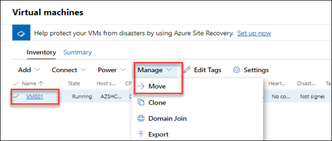
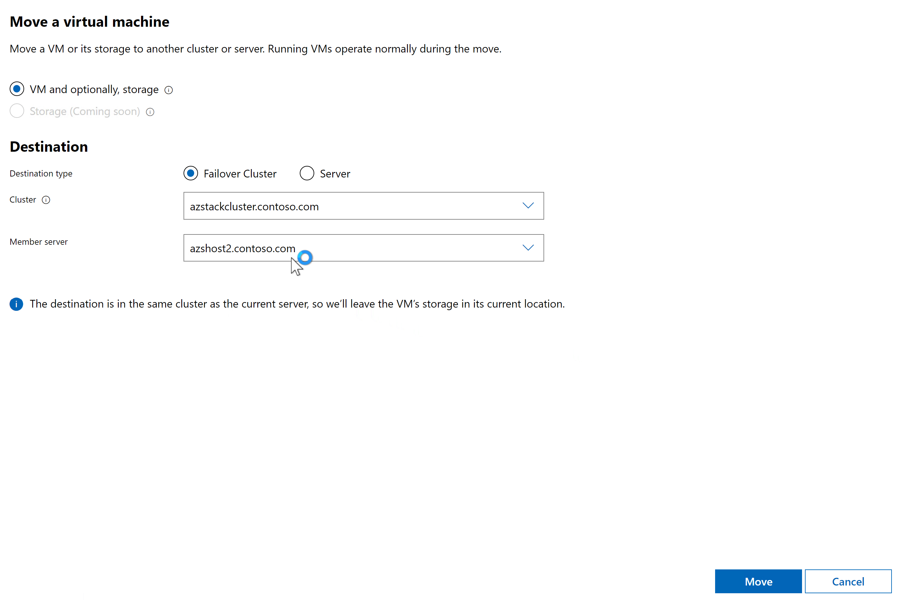
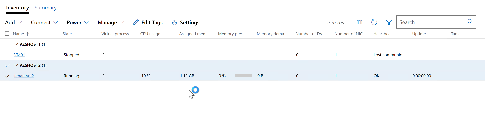

# Lab 02 : Create Tenant VMs and attach to SDN VM Network

## Objective

In this scenario, you have been asked to create two Windows Server Datacenter tenant VMs in a SDN VM Network. These tenant VMs will only be able to talk with one another.

You come up with the following action plan:

1. Create a SDN VM Network named **TenantNetwork1** in Windows Admin Center with a Address Prefix of **192.172.0.0/16**

2. Carve out a subnet named **TenantSubnet1** from the **TenantNetwork1** Address Prefix that you just created. This subnet will be: **192.172.33.0/24**

3. Create the VHDX files for VMs **TenantVM1** and **TenantVM2** on the Cluster Storage in the S2D cluster: **SDNCluster**

4. In Windows Admin Center, create **TenantVM1** and **TenantVM2** virtual machines and then connect their network adapters to **TenantSubnet1**

5. Run Ping tests to validate VXLAN communication between both VMs.

6. Live migrate the VM to the second HCI host deployed in the cluster

## Exercise 01:   Create a SDN VM Network named **TenantNetwork1** in Windows Admin Center with a Address Prefix of **192.172.0.0/16**

1. Navigate to **Windows Admin Center -> azstackcluster.com -> Networking -> **Virtual Networks**. In **Virtual Networks**, select **Inventory**.

2. In **Inventory** select **+ New**

1. In the Virtual Network dialog, fill in the following and then click **Submit**:

|   |   |
|---|---|
| Virtual Network Name:  |  **TenantNetwork1**  |
| Address Prefixes:  | add  **192.172.0.0/16**  |
| Subnet Name: | add **TenantSubnet1**   |
| Subnet Address Prefix: | add **192.172.33.0/24**  |

1. Wait about a minute and then you should see the following in your Virtual Networks inventory:

1. Step 01 is now complete.

## Exercise 02: Create the TenantVM's virtual hard disks*

1. In the **Console** VM, open a **PowerShell** console with Admin rights.

2. In the PowerShell console, navigate to ``C:\SDNEXAMPLES\01_Create_TenantVMs\``

3. Run ``.\01_Create_TenantVMs.ps1``

4. Wait for the script to successfully complete

> This script copies the GUI.VHDX to folders on the C:\ClusterStorage\<volume>\ drive, injects answer files that specify the VM's Name, Product Key, and also disables Windows Firewall so you can easily perform a ping test.

## Exercise 03: Create **TenantVM1** and **TenantVM2** virtual machines and then connect their network adapters to **TenantSubnet1**

1. Go to **Windows Admin Center**

2. Navigate to **Windows Admin Center -> azstackcluster.com -> Virtual Machines**. In **Virtual Machines**, select **Inventory**.

3. In **Inventory** select **+ New**

4. Fill in the **New Virtual Machine Dialog with the following and then click **Create**:

 | Setting   | Value  |
|---|---|
| Name:  |  **TenantVM1** |
| Generation:  | **Generation 2**  |
| Host:    | **SDNHOST2**    |
| Path:   | *Leave Default*     |
| Virtual Processor Count:   |  **2**  |
| Memory:   | **2GB**   |
| Use dynamic memory:   |  *selected*  |
| Network adapter:   | **sdnSwitch**  |
| Virtual Network:   | **TenantNetwork1**   |
| Virtual Subnet:  |  **TenantSubnet1 (192.172.33.0/24)**  |
| IP Address:   |  **192.172.33.4**  |
| Storage:   | *select* **Add disk**   |
| Use an existing virtual hard disk:   | *Select* **Use and existing virtual hard disk** |
| Path:   | **C:\ClusterStorage\S2D_vDISK1\TenantVM1\GUI.vhdx**   |

>

5. Repeat the last step, except enter the values for **TenantVM2**:

 | Setting   | Value  |
|---|---|
| Name:  |  **TenantVM2** |
| Generation:  | **Generation 2**  |
| Host:    | **SDNHOST3**    |
| Path:   | *Leave Default*     |
| Virtual Processor Count:   |  **2**  |
| Memory:   | **2GB**   |
| Use dynamic memory:   |  *selected*  |
| Network adapter:   | **sdnSwitch**  |
| Virtual Network:   | **TenantNetwork1**   |
| Virtual Subnet:  |  **TenantSubnet1 (192.172.33.0/24)**  |
| IP Address:   |  **192.172.33.5**  |
| Storage:   | *select* **Add disk**   |
| Use an existing virtual hard disk:   | *Select* **Use and existing virtual hard disk** |
| Path:   | **C:\ClusterStorage\S2D_vDISK1\TenantVM2\GUI.vhdx**   |

6. After both VMs have been created, start both of them and then continute onto the next step.

## Exercise 04: Run Ping tests to validate VXLAN communication between both VMs.

1. Using Windows Admin Center's **VM Connect** or **Hyper-V Manager**  log into **TenantVM1 (192.172.33.4)**

2. From a **CMD** Prompt or a Windows PowerShell prompt, Try pinging **192.172.33.5**.

 "Inventory Screen for Virtual Machines")

3. If you are successful, then you have successfully created a TenantVM Network and have two Hyper-V virtual machines communicating over that network.

## Exercise 05; Live migrate a virtual machine to another node

The final step we'll cover is using Windows Admin Center to live migrate VM001 from it's current node, to an alternate node in the cluster.

1. Still within the **Windows Admin Center** on **azstackcluster.contoso.com**, under **Compute**, click on **Virtual machines**

2. On the **Virtual machines** page, select the **Inventory** tab

3. Under **Host server**, make a note of the node that the virtual machine is currently running on.  You may need to expand the column width to see the name

4. Next to **vm name**, click the tick box next to VM001, then click **More**.  You'll notice you can Clone, Domain Join and also Move the VM. Click **Move**

    

5. Select the **Failover Cluster** from the drop down and leave the defaul on **Cluster** and  **Member Server**. You should see that the default member server selection is the **azshost2.contoso.com (Recommended)r**, since currently the VM is deployed at host 1, so we are moving it to the second host we have on our azstackcluster.contoso.com.  Then click **Move**.

    
    
6. The live migration will then begin, and within a few seconds, the VM should be running on a different node. You should see, after the migration is completed, that the vm is now deployed on HOST 2.

    
    

Proceed to the next exercise... 

