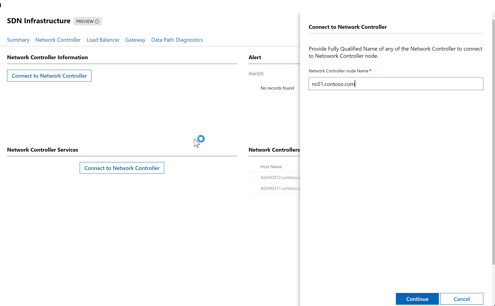

# Lab 04 : Software Load Balancers and other things...


## Objective

In this series of exercises, you will learn to configure software load balancing.

# Lab 03.01 Create a public VIP for load balancing a pool of two VMs on a virtual network

In this lab, you will deploy a solution with the following requirements:

1. Deploy two web server VMs.
2. Load balance these VMs on Ports 80 (Web) and 3389 (RDP).
3. Ensure that a health probe is enabled for the website.

 

## Exercise 01: Deploy the Web Server VMs

1. In the **Console** VM, open a **PowerShell** console with Admin rights.

2. In the PowerShell console, navigate to ``C:\SDNEXAMPLES\03_Software_Load_Balancers_NAT\03.01_Create_WebServerVMs.``

3. Run ``.\03.01_Create_WebServerVMs.ps1``

4. Wait for the script to successfully complete

> This script:
     1. Creates two Windows Server (Desktop Experience) VHD files for WebServerVM1 and WebServerVM2, injects a unattend.xml
     2. Creates the WebServerVM1 and WebServerVM2 virtual machines
     3. Adds WebServerVM1 and WebServerVM2 to the SDNCluster
     4. Creates a VM Network and VM Subnet in Network Controller
     5. Creates WebServerVM1 and WebServerVM2 Network Interfaces in Network Controller
     6. Sets the port profiles on WebServerVM1 and WebServerVM2 Interfaces

## Exercise 02: Deploy the Load Balancer

In this exercise, you will run a script that will create the Load Balancer and VIP for the DIPs (WebServerVM1/VM2). The Load Balancer will forward TCP traffic for ports 80 and 3389.

1. From the desktop on the console VM, load the PowerShell ISE with Admin Rights.

 

1. In the PowerShell ISE, navigate to ``C:\DNEXAMPLES\03_Software_Load_Balancers_NAT\``

2. Load the file ``.\03.01_LoadBalanceWebServerVMs.ps1``

3. Examine the PowerShell Script to see how the Load Balancer is provisioned.

4. Run the script.

5. After the script completes, take note of the VIP that was assigned.

 

## Exercise 03: Test the Load Balancer

In this exercise, you will test out the load balancer.

1. Go to Winddows Admin Center -> azstackcluster.contoso.com -> Under Networking, click on **SDN Infrastructure**. 

2. From the top menu, select **Network Controller** and then, in the main page, click on **Connect Network Controller**. Add the domain "nc01.contoso.com" and click Continue.



3. Scroll Down the **Network Controller** information page, till you see the **Network Controller Node** info. Check on which HCI host your nc01.contoso.com -network controller is deployed. In my case, I see is host 2.


4. Go back to the main page on Windows Admin Center, click on the right host (in my case azshost2.contoso.com). Scroll down the left menu, then click on "Virtual Machines", select NC01 vm listed and click on Power. You need to turn off this VM so we can assign more memory to it.

5. When the NC01 VM is Stopped, click on Settings > Memory > change the Startup memory to 5.

6. Start NC01 VM again

7. Go back to the Windows Admin Center -> azstackcluster.contoso.com -> SDN Infrastructure -> and check if the network controller is up and running again with "Healthy" status.

8. Go to the desktop on the console VM, load the PowerShell Console with Admin Rights.

9. To test to see if the RDP Server is working, run the following command:  ``mstsc /v:<vip ipaddress>``

 

10. You should see a password prompt. After entering the password, you should receive a certificate warning dialog. Note that you are being routed to either WebServerVM1 or WebServerVM2.

 "RDP Certificate Warning Dialog") 

11. After connecting with RDP, log out of the RDP Session.

12. Next, open up a web browser and navigate to ``http://<vip ipaddress>``.

> **Note:** Please use HTTP and not HTTPS.

13. In the browser, take a look at the server being connected to. Notice that if you hit refresh on the browser, you are redirected to the same server. In order to see load balancer switching servers, you will need to open multiple InPrivate browser tabs and connect to the VIP until you connect to the other server.

## Exercise 04: Examine Load Balancer Deployment with SDN Explorer

In this exercise, you will use SDN Explorer to view load balancer configuration in the Network Controller database.

1. Log into **Console** using RDP.
2. On the desktop, **Right-Click** on the **SDN Explorer** shortcut and select **Run with PowerShell**.

 

3. SDN Explorer will now appear.

 

4. In SDN Explorer, select Public IP Addresses. 

5. Next, select the WEBLB-IP button.

6. In the WEBLB-IP configuration, take note of the Public IP address and the reference to the WEBLB load balancer configuration.

 

7. Next, go back to the SDN Explorer main menu and click Load Balancer, select the WEBLB and then view its properties. Notice the references to the Backend Servers (Network Interfaces) which are the web servers, and the load balancer rules which are located below in the configuration. 

 

If you look at the load balancer rules below, you can see the rules for ports 80 and 443. Notice the ```enableFloatingIP``` setting. We'll look at this in lab 3.04.

 

And finally, you can see the health probe that was also created:

 
