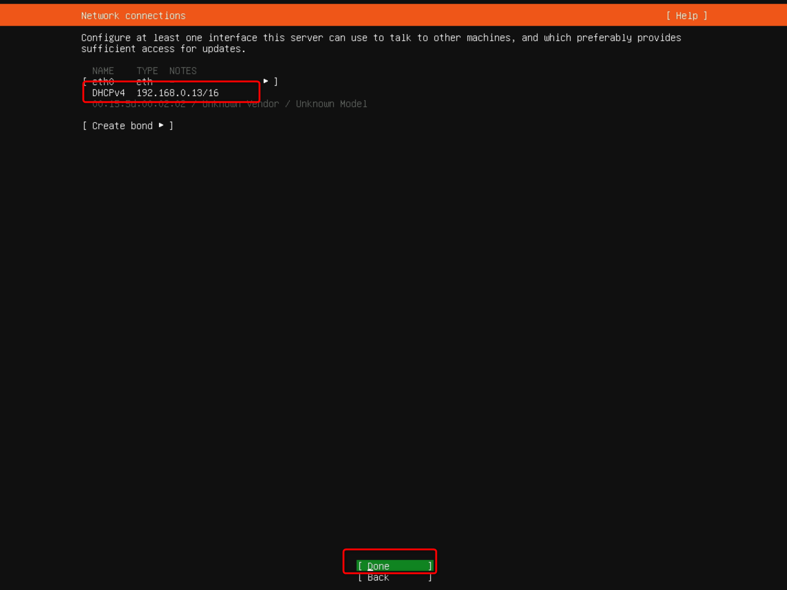

# Lab 5: Deploying Ubuntu on Stack HCI cluster 

Now that you have create a Windows Virtual Machine in your Azure Stack HCI, we are deploying an Ubuntu vm.

Task 1: Download .Iso files
-----------
In this step, you will download a Ubuntu Server 20.04 .Iso file and upload the .Iso to your Clustered Shared Volume you created in Task 1.

### Download an Ubuntu Server 20.04 .Iso ### 
 
1. Please download Ubuntu Server 20.04 image file from [here](https://releases.ubuntu.com/20.04/ubuntu-20.04.4-live-server-amd64.iso)
 
2. The download of the ISO file should automatically start. Once completed you should find it in your Downloads folder.

### Upload the .Iso files to your CSV ###
 
1. Open Windows Admin Center, click on your previously deployed cluster, azstackcluster.contoso.com
 
    
 
2. On the left hand navigation, under Compute select Servers and then Inventory.
 
    

3. Click on node AzHOST1 and then click in Manage
 
    
 
4. On the left, select Files & file sharing
  
    
  
5. Open the folder C:\ClusterStorage\S2D_vDISK1
 
 
6. Click in the "…" and then Upload
 
    
  
7. Click in Select Files, search for the .iso file in Downloads and click in Open, and then Submit. 
 
    
 
8. It takes around 5-10 minutes to get successfully uploaded. After that, please move on to the next task.

Task 2: Deploy an Ubuntu Server 20.04 virtual machine
----- 
In this step, you will deploy an Ubuntu Server 20.04 virtual machine via Windows Admin Center.

1. Once logged into the **Windows Admin Center**, click on your previously deployed cluster, **azstackcluster.contoso.com**

2. On the left hand navigation, under **Compute** select **Virtual machines**.  
    
    

3. On the **Virtual machines** page, select the **Inventory** tab, and then click on **Add** and select **New**.

    
 
4. In the New virtual machine pane, enter UbuntuVM for the name, and enter the following pieces of information, then click Create
 
     * Generation: Generation 2 (Recommended)
 
     * Host: Leave as recommended
 
     * Path: leave default
 
     * Virtual processors: 2
 
     * Startup memory (GB): 2
 
        * Use dynamic memory: -
 
     * Network: sdnSwitch
     
     * Virtual Network:	TenantNetwork1
     
     * Virtual Subnet:	TenantSubnet1 (192.172.33.0/24)
     
     * IP Address:	192.172.33.10
 
     * Storage: Add, then Create an empty virtual hard disk and set size to 30GB
 
     * Operating System: Install an operating system from an image file (.iso). Select the Ubuntu Server 20.04 Iso file!
 
      
      
        
 
5. The creation process will take a few moments, and once complete, UbuntuVM should show within the Virtual machines view

6. Click on the VM name VM002 and then Click on Settings to view all VM properties. Click on Security
 
      

7. Make sure to change the Secure Boot template to "Microsoft UEFI Certificate Authority" in the Template drop down box, and click save security settings. Click Close.

      

8. Click on Power button and select Start - within moments, the VM should be in a running state soon.

      

9. Click on Connect and select connect button from the drop down- you may get a VM Connect prompt.
 
      

10. When prompted with the certificate prompt, click Connect and enter Password as `Password01`.
  
    

11. Once the integrity check is done you will be able to select your language. Select English.

    

12. On the Installer update available screen, select "Continue without updating"

    

13. On the Keyboard configuration screen, select "Done"

    

1. On the Network connections screen, remember the assigned IP address and select "Done"

    

14. On the Configure proxy screen, select "Done"

    

15. On the Configure Ubuntu archive mirror screen, select "Done"

    

16. On the Guided storage configuration screen, select "Done"

    

17. On the storage configuration screen, select "Done" and then Select "Continue" to confirm the destructive action popup screen.

    
    

18. On the Profile setup screen complete the fields a below and then select "Done"
     * Your name: administrator
 
     * Your server's name: ubuntuvm
 
     * Pick a username: administrator
 
     * Choose a password: Password01

     * Confirm your password: Password01

    

19. On the Enable Ubunutu Advantage screen, select "Done"

    

20. On the SSH setup screen, select "Install openSSH server" and select "Done"

    

21. On the Featured Server snaps screen, select "Done"

    

22. Now wait until you get the Install complete! screen and select "Reboot Now"

    

23. On the following screen press "ENTER", now the virtual machine will reboot.

    

24. Once the virtual machine is up and running try to login!

    
