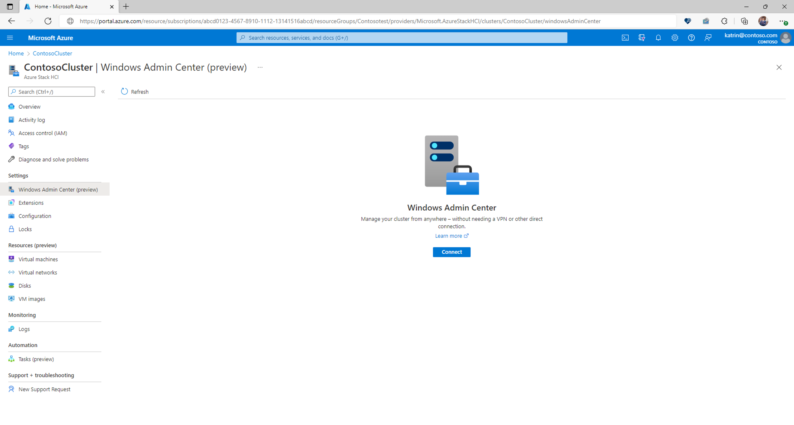

# Lab 6: Manage Azure Stack HCI clusters using Windows Admin Center in Azure

Using Windows Admin Center in the Azure portal you can manage the Azure Stack HCI operating system of your cluster. You can securely manage your cluster from anywhere–without needing a VPN, public IP address, or other inbound connectivity to your machine.

With Windows Admin Center extension in Azure, you get the management, configuration, troubleshooting, and maintenance functionality for managing your Azure Stack HCI cluster in the Azure portal. Azure Stack HCI cluster and workload management no longer require you to establish line-of-sight or Remote Desktop Protocol (RDP)–it can all be done natively from the Azure portal.

Azure Stack HCI requirements
-----------

-Azure Stack HCI, version 21H2 or later
- 3 GB of memory or more
- The Azure Stack HCI cluster must be connected to Azure using Azure Arc
- Azure Arc agent version 1.13.21320.014 or late
- Outbound internet access or an outbound port rule allowing HTTPS traffic to the following endpoints: 
    *.wac.azure.com,
    pas.windows.net,
    *.servicebus.windows.net.

Task 1: Install Windows Admin Center in the Azure portal
-----------

Before you can use Windows Admin Center in the Azure portal, you must deploy the Windows Admin Center VM extension using the following steps:

1. Open the Azure portal and navigate to your Azure Stack HCI cluster.
2. Under the Settings group, select Windows Admin Center.
3. Specify the port on which you wish to install Windows Admin Center, and then select Install

 
 Task 2: Connect to Windows Admin Center in the Azure portal
-----------

1. Open the Azure portal and navigate to your Azure Stack HCI cluster, and then under the Settings group, select Windows Admin Center.
2. Select Connect.
3. Enter credentials for your account (user:Contoso\Administrator Password: Password01) and then select Sign in.

4. Windows Admin Center opens in the portal, giving you access to the same tools you might be familiar with from using Windows Admin Center in an on-premises deployment.

