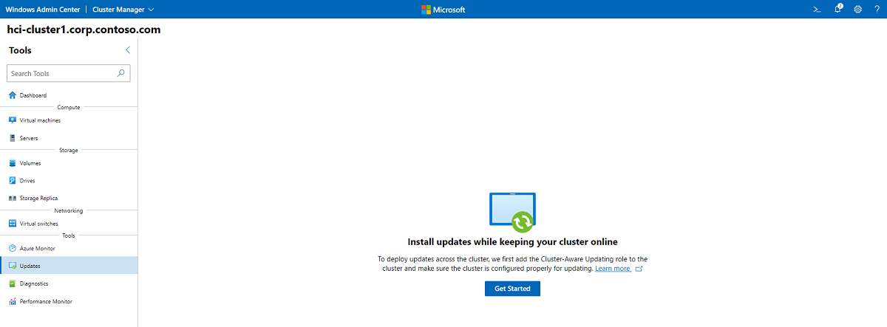

# Azure Stack HCI Cluster Maintainence

## Updating an Azure Stack HCI Cluster

When updating Azure Stack HCI clusters, the goal is to maintain availability by updating only one server in the cluster at a time. Many operating system updates require taking the server offline, for example to do a restart or to update software such as the network stack. We recommend using Cluster-Aware Updating (CAU), a feature that makes it easy to install updates on every server in your cluster while keeping your applications running. Cluster-Aware Updating automates taking the server in and out of maintenance mode while installing updates and restarting the server, if necessary. Cluster-Aware Updating is the default updating method used by Windows Admin Center and can also be initiated using PowerShell.

This topic focuses on operating system and software updates. If you need to take a server offline to perform maintenance on the hardware, see Take a server offline for maintenance.

Update a cluster using Windows Admin Center
Windows Admin Center makes it easy to update a cluster and apply operating system and solution updates using a simple user interface. If you've purchased an integrated system from a Microsoft hardware partner, it’s easy to get the latest drivers, firmware, and other updates directly from Windows Admin Center by installing the appropriate partner update extension(s). If your hardware was not purchased as an integrated system, firmware and driver updates may need to be performed separately, following the hardware vendor's recommendations.

 **Warning**

If you begin the update process using Windows Admin Center, continue using the wizard until updates complete. Do not attempt to use the Cluster-Aware Updating tool or update a cluster with PowerShell after partially completing the update process in Windows Admin Center. If you wish to use PowerShell to perform the updates instead of Windows Admin Center, skip ahead to Update a cluster using PowerShell.

Follow these steps to install updates:

When you connect to a cluster, the Windows Admin Center dashboard will alert you if one or more servers have updates ready to be installed, and provide a link to update now. Alternatively, you can select Updates from the Tools menu at the left.

If you are updating your cluster for the first time, Windows Admin Center will check if the cluster is properly configured to run Cluster-Aware Updating, and if needed, will ask if you’d like Windows Admin Center to configure CAU for you, including installing the CAU cluster role and enabling the required firewall rules. To begin the update process, click Get Started.

